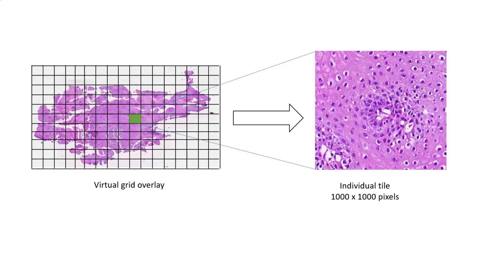
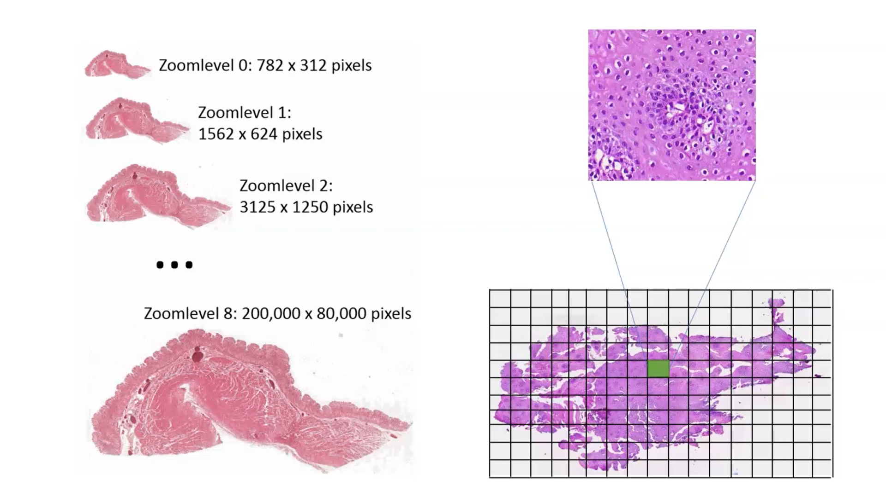

Tile server is a service that serves tiles. Tiles are small images that are used to build a map. Tile server is a server that serves tiles. Tiles are small images that are used to build a map. 

Tile server divides the map into grid and each grid is called tile. Each tile is a small image. Tile server serves these tiles to the client. Client uses these tiles to build a map.

Tiles servers breaks the original image in a consecutive series of higher resolution images at the lowest level of resolution. Just looking at a thumbnail image at the deepest or highest level. So we have a pyramid at each tile having a lowest to highest resolution of images.

# Different types of Tile Servers

There are different types of tile servers. Some of them are:

-   **Raster Tile Server**: Raster tile server is a server that serves raster tiles. Raster tiles are small images that are used to build a map. Raster tile server is a server that serves raster tiles. Raster tiles are small images that are used to build a map.

-   **Vector Tile Server**: Vector tile server is a server that serves vector tiles. Vector tiles are small images that are used to build a map. Vector tile server is a server that serves vector tiles. Vector tiles are small images that are used to build a map.

# Example of Tile Server

There are many examples of tile servers. Some of them are:

-   pg_tileserv
-   t-rex
-   GeoDB
-   CartoDB and many more.